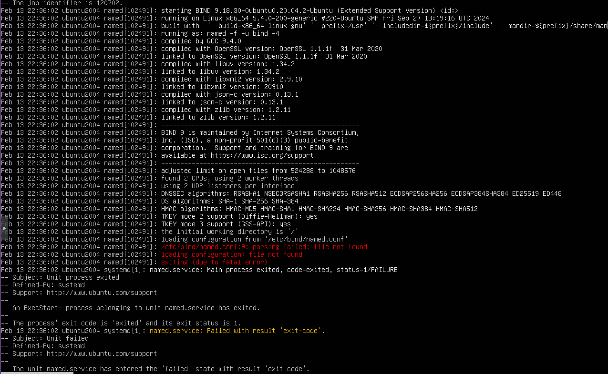

# DNS Lab Notes
Before doing anything, make sure your devices are connected to the internet by configuring the network information for both devices.
## P1: DNS Installation
Refresh the package list to make sure that you are installing the most current version of bind9, then install bind9
```
sudo apt update
sudo apt install bind9
```

## P2: DNS Configuration
### 1. Forward lookup zone for all domains with A records in the Internal Domains table
Edit named.conf.local and add the forward zone. Here is an example of what it looks like:
```
zone "friedchicken.local" {
    type master;
    file "/etc/bind/db.friedchicken.local";
};
```
<br>

Create the forward zone file by copying the default template
```
sudo cp /etc/bind/db.local /etc/bind/db.friedchicken.local
```
<br>

Replace the content with the correct domains and records. Here is a sample of what it would look like:
```
$TTL 604800
@   IN  SOA ns.friedchicken.local. admin.friedchicken.local. (
        2         ; Serial
        604800    ; Refresh
        86400     ; Retry
        2419200   ; Expire
        604800 )  ; Negative Cache TTL

; Name Server
@       IN  NS      ns.friedchicken.local.

; A Records
ns          IN  A   192.168.5.10
intranet    IN  A   192.168.5.30
hr          IN  A   192.168.5.31
finance     IN  A   192.168.5.32
dev         IN  A   192.168.5.33
qa          IN  A   192.168.5.34
helpdesk    IN  A   192.168.5.35
inventory   IN  A   192.168.5.36
wiki        IN  A   192.168.5.37
```

### 2. Reverse lookup zone for all the domains with PTR records in the Internal Domains
Edit named.conf.local again and add the reverse zone. Here is an example of what it looks like:
```
zone "5.168.192.in-addr.arpa" {
    type master;
    file "/etc/bind/db.192.168.5";
};
```
<br>

Create the reverse zone file by copying the default template.
```
sudo cp /etc/bind/db.127 /etc/bind/db.192.168.5
```
<br>

Replace the content with the correct domains and records. Here is a sample of what it would look like:
```
$TTL 604800
@   IN  SOA ns.friedchicken.local. admin.friedchicken.local. (
        2         ; Serial
        604800    ; Refresh
        86400     ; Retry
        2419200   ; Expire
        604800 )  ; Negative Cache TTL

@       IN  NS      ns.friedchicken.local.

10      IN  PTR     ns.friedchicken.local.
30      IN  PTR     intranet.friedchicken.local.
31      IN  PTR     hr.friedchicken.local.
32      IN  PTR     finance.friedchicken.local.
33      IN  PTR     dev.friedchicken.local.
34      IN  PTR     qa.friedchicken.local.
35      IN  PTR     helpdesk.friedchicken.local.
36      IN  PTR     inventory.friedchicken.local.
37      IN  PTR     wiki.friedchicken.local.
```
**Make sure to increase the serial number if you edit the zone files again or else the system won't know it was updated.**

## P3: Troubleshooting
Include these lines in the option block in the `named.conf.options` file to make sure everything passes:
```
options {
    directory "/var/cache/bind";

    listen-on { 127.0.0.1; 192.168.5.10; };
    listen-on-v6 { none; };

    allow-query { any; };
    recursion yes;
};
```

Make sure all your file paths are correct. (Ex: Files are stored in /etc/bind, not /etc/bind9)

## M1: DNS Installation and Configuration
This part works very similarly to P2 so you can pretty much just follow the instructions there. The files will be named something like db.friedchicken.com and db.172.18 for the external forward and reverse files respectively. 

You will need to include the CNAME record in the forward file. The line will look something like this:
```
www     IN  CNAME   friedchicken.com.
```

## M2: DNS Security
I think I just passed this part without really doing anything (and I don't have a record of what I did), but this what Claude recommended doing for this part:

Edit the BIND options file (`named.conf.options`) so that the options block includes ACLs and per-zone restrictions. The best way to do this is by defining ACLs at the top of `named.conf.local`.
```
// ACL Definitions
acl internal_clients {
    192.168.0.0/16;
};

acl external_clients {
    172.18.0.0/16;
};

// Internal Forward Zone
zone "friedchicken.local" {
    type master;
    file "/etc/bind/zones/db.friedchicken.local";
    allow-query { internal_clients; };
};

// Internal Reverse Zone
zone "168.192.in-addr.arpa" {
    type master;
    file "/etc/bind/zones/db.192.168";
    allow-query { internal_clients; };
};

// External Forward Zone
zone "friedchicken.com" {
    type master;
    file "/etc/bind/zones/db.friedchicken.com";
    allow-query { external_clients; };
};

// External Reverse Zone
zone "18.172.in-addr.arpa" {
    type master;
    file "/etc/bind/zones/db.172.18";
    allow-query { external_clients; };
};
```
Check to make sure the configuration is correct and restart BIND.

## M3: Troubleshooting
The process for troubleshooting will be similar to P3, except you will be checking the external zone files. I will have more troubleshooting in the troubleshooting section.

At this point, my lab randomly broke because the BIND service failed and it wouldn't start again (despite not having any issue beforehand).

### Issue 1: Wrong File Path in `include` Statment 
This is the error I was getting:

This particular issue was resolved once I fixed the include statment on line 9 of `named.conf`. For some reason, it changed from:
```
include "/etc/bind/named.conf.options";
```
to:
```
include "/etc/bind/.named.conf.options";
```
When I tried editing `named.conf`, it said that the operation was not permitted. This was because there was an immutable attribute set. I checked it with the `lsattr` command and saw an `i` in the output (it looked something like `----i----------`). I removed it with the `chattr` command like this:
```
sudo chattr -i /etc/bind/named.conf
```
_*Note: To add an immutable flag, use the `+i` flag instead of `-i`._

### Issue 2: File Permissions
BIND needs read access to config files and write access to its working directory. For some reason, the permissions were changed with all the config files so BIND was not able to access them, so I changed them back. (Usually, Ubuntu sets permissions and ownership correctly automatically, but I guess it got messed up.)

## D1: Recursive Resolver for Internal Clients Only
This can be resolved by setting up ACLs and adding `allow-recursion` in the `named.conf.options` file. Then you need to set `allow-query` for each zone correctly in `named.conf.local`. This was my final configurations for both:


This is important to implement for security. It avoids people being able to use the DNS server for DDoS attacks. It also lowers the use of DNS resources (like CPU, memory, and bandwidth) and avoids any information being leaked. Basically, this step allows your internal machines to resolve both internal domains and public domains using the DNS server, but prevents externals users from using the DNS server for more than just resolving our own public domains.

## D2: Disable Zone Transfers
This one is really easy. Just add the line `allow-transfer { none; };` to the `named.conf.options` file. (Refer to the image above of `named.conf.options` to see exactly where it goes.) You can also add `allow-transfer { none; };` in every zone like this:
```
zone "friedchicken.com" {
    type master;
    file "/etc/bind/zones/db.friedchicken.com";
    allow-query { external-nets; internal-nets; };
    allow-transfer { none; };
};
```
This will prevent secondary DNS servers from copying zone data, which prevents them from exfiltrating data when they aren't authorized
<br>
<br>

# DNS CentOS Instructions (1st Team Lab)
CentOS works really similarly to Ubuntu with a few differences that I will outline here. I will also outline any issues that we had that were specific to this OS or lab.

## CentOS and Ubuntu Differences
### CentOS Installer
CentOS 7 uses an installer called `yum`. CentOS 8/Stream uses `dnf`. So basically replace `apt` with `yum` and you are off to the races. Also, the BIND9 package for CentOS is called `bind`. Also when the BIND service is running, it is called `named` so, you will just type in `named` when checking the DNS service.

### BIND File Layout Differences
On Ubuntu, BIND stores configs in `/etc/bind/` with all the zone and config files being in that directory. On CentOS, the config files are stored in two different places. The main config file is located at `/etc/named.conf`, along with other config files. 

Ubuntu usually splits conf files into many smaller files. So the options file is not separate, rather it is in the options block in the `named.conf` file. Same goes with the `db.local`, `db.127`, and `db.empty` files. They all become part of the `named.conf.default-zones` file in CentOS.

The zone files are located in `/var/named/` by default. Because the `named.conf` file just points to wherever and whatever you want it to, you can move these files into `/etc`. In fact, for the second team lab, we ended up moving the zone files to `/etc/named/`.

So basically:<br>
**Ubuntu (Debian-style BIND layout) typical structure:**
```
/etc/bind/
 ├── named.conf                // Just includes other files
 ├── named.conf.options        // Global settings
 ├── named.conf.local          // Custom zones
 ├── named.conf.default-zones  // Default zones
 ├── db.example.com            // External zone records (A, CNAME, etc.)
 ├── db.example.internal       // Internal zone records (A, etc.)
 ├── db.192.168.1              // Reverse zone records (PTR, etc.)
```
So ubuntu usually splits the config, zone declarations, and zone records.

**CentOS/RHEL (Red Hat Style Layout)**
```
/etc/named.conf        // Global settings, custom zones, ACLs, etc.
/var/named/
 ├── named.localhost   // Default zone records
 ├── named.loopback    // Default zone records
 ├── example.com.zone  // External zone records
 ├── 1.168.192.rev     // Reverse zone records

```

### Setting Permissions
Ubuntu usually sets BIND's file permissions and owners automatically. CentOS does not do this, so you need to make sure to set them manually. BIND/named should be a group owner and have read access to all conf and zone files (directories should be executable).
```
sudo chown root:named /path/to/file
sudo chmod 640 /path/to/file
```

### Firewall Settings
_*Note: This difference didn't matter in this lab because the firewall service wasn't running, but it may be helpful for other things._<br>
CentOS may block DNS by default. This will need to be fixed by running the commands:
```
sudo firewall-cmd --add-service=dns --permanent
sudo firewall-cmd --reload
```

### `"."` Zone
CentOS will have a zone in the `named.conf` file that will look like this:
```
zone "." IN {
    type hint;
    file "named.ca";
};
```
That is called a root hint zone and needs to be kept so **don't** remove it.

## Issues Specific to This OS/Lab
### TCP Not Forwarding to DNS
TCP traffic is not normally supposed to be forwarding to the DNS server, but for some reason, adding the TCP port forwarding rule helped the issues I was having with this lab. This may be because DNS servers sometimes use TCP traffic, but this should only be used as a last-ditch effort. You can add the port forwarding rule to a MicroTik router with this command:
```
/ip firewall nat add chain=dstnat action=dst-nat to-addresses=<DNS_ip_address> protocol=tcp in-interface=ether3 dst-port=53
```
To check the rule was properly added, run:
```
/ip firewall nat print
```
To delete a NAT rule, figure out its number and run:
```
/ip firewall nat remove <NAT_number>
```

### Assigning More than One Address to One Interface
On `ens18`, I accidentally configured the interface to have two IP addresses assigned to it instead of just the one IP address assigned to the DNS server. So after I removed the IP address that was the router's IP address, it fixed the issue.
<br>
<br>

# Troubleshooting/Miscellaneous Tips & Commands

### The Most Basic Yet Important Troubleshooting Commands
- `sudo named-checkconf` - checks for any syntax errors in named.conf
- `sudo named-checkzone <zone_name> <zone_file>` - checks the zone for any syntax errors
- `systemctl status named` - checks if BIND/named is running and gives you a few lines of logs (replace `named` with `bind9` if needed)
- `systemctl restart named` - restarts the BIND/named service and tells you why it failed if it does; **RUN THIS AFTER EVERY CHANGE** (replace `named` with `bind9` if needed)
- `ss -tulnp | grep :53` - tells you all the IPs that are listening on port 53 (`-t` flag shows tcp connections only, `-u` flag shows udp connections only)
- `sudo journalctl -xe | grep named` - gives you more detailed logs of anything to do with named service
- `nslookup example.com` - tests the domain or IP address to make sure it resolves
- `dig example.com` - does the same as `nslookup`, but gives a more detailed response (I personally prefer this over `nslookup`)

### Reverse Zone Name and Subnet Masks
Determining the reverse zone name (all the stuff that goes before `.in-addr.arpa`) can be a little tricky. Here is a little step-by-step explanation to help out:

**Step 1:** First, you need to figure out what your network address is. You can use `ip addr` to determine this or refer back to the topology. We'll say that mine in this example is:
```
192.168.1.10/16
```

**Step 2:** Next, you need to determine what is the network portion of your IP address by taking a look at your subnet. In our example, the network portion is:
```
192.168
```
...because of the subnet of /16. If we had a subnet of /24, the network portion would be:
```
192.168.1
```

**Step 3:** Now that you know the network portion, you can assign it to your zone name. Because this is a zone name for a reverse zone, you need to reverse the network part, then tack on .in-addr.arpa. So for our example, we reverse it:
```
168.192
```
Then we add the ending to create the final reverse zone name:
```
168.192.in-addr.arpa
```

**Step 4:** After adding the zone with its proper zone name to the named conf file, you will need to create the reverse zone file. The reverse zone records are also impacted by the subnet mask because the remaining portion of the IP address that was not used for the zone name will be used for the PTR records and they will remain reversed. So with our example, the reverse zone file would look something like:
```
$TTL 86400
@   IN  SOA ns1.team2.cyberjousting.org. admin.team2.cyberjousting.org. (
        2026021301
        3600
        1800
        604800
        86400 )

    IN  NS  ns1.team2.cyberjousting.org.

10.1  IN  PTR ns1.team2.cyberjousting.org. ; Notice that 10.1 is reversed
```

### Missing Trailing Dot
Make sure that in every zone file, you end the FQDNs with a dot, or else BIND will append the zone name.<br>
**NOT:**
```
@   IN  SOA ns1.team2.cyberjousting.org admin.team2.cyberjousting.org {
```
**CORRECT:**
```
@   IN  SOA ns1.team2.cyberjousting.org. admin.team2.cyberjousting.org. {
```

### Options Directory Path
Inside the options block, there is usually something that looks like this:
```
directory "/var/named";
```
This will make BIND look inside whatever directory is lined out there. So when writing out zones, make sure you take into account that whatever file path is listed is basically added in front of whatever file you line out for a zone. So, when you write this in the zone:
```
file "example.com";
```
BIND will actually look in this file path:
```
/var/named/example.com
```

### `listen-on` vs. `allow-query`
The `listen-on` line of the options block tells the DNS which ports to listen to. If it is set to `any;`, then it will listen on all ports. Think of this as stating which doors are open. (You usually want to be listening to your own IP address so that other machines can use it.)

The `allow-query` line of the options block tells the DNS which addresses should be allowed to send queries to the DNS. So, keeping to our door analogy, it states who is allowed to walk in to the open door.

### Ubuntu running BIND in a restricted sandbox
_*Note: This is a ChatGPT suggestion. I never used this to solve a problem but it may be helpful._<br>
Ubuntu may ignore interfaces unless you allow them.<br>
Edit `/etc/default/named`.

You may see:
```
OPTIONS="-u bind"
```

Change it to:
```
OPTIONS="-u bind -4"
```
Save and restart.
<br>
<br>

# Common Errors

## Dig Errors and What They Mean
Before talking about any errors, I'm going to walk through a typical `dig` output and explain section by section. 

### Dig Output Explanation
Here is an example output for the command `dig example.com`:
```
; <<>> DiG 9.18.18 <<>> example.com
;; global options: +cmd
;; Got answer:
;; ->>HEADER<<- opcode: QUERY, status: NOERROR, id: 45832
;; flags: qr rd ra; QUERY: 1, ANSWER: 1, AUTHORITY: 0, ADDITIONAL: 1

;; OPT PSEUDOSECTION:
; EDNS: version: 0, flags:; udp: 512
;; QUESTION SECTION:
;example.com.                   IN      A

;; ANSWER SECTION:
example.com.            86400   IN      A       93.184.216.34

;; Query time: 24 msec
;; SERVER: 192.168.1.1#53(192.168.1.1) (UDP)
;; WHEN: Sun Feb 15 10:30:45 UTC 2026
;; MSG SIZE  rcvd: 56
```
---
**Header section:**
```
;; ->>HEADER<<- opcode: QUERY, status: NOERROR, id: 45832
;; flags: qr rd ra; QUERY: 1, ANSWER: 1, AUTHORITY: 0, ADDITIONAL: 1
```
- `status: NOERROR` - the query succeeded. Other statuses include `NXDOMAIN`, `SERVFAIL`, or `REFUSED` which will be explained further below.
- `flags`:
    - `qr` - this is a response (query response)
    - `rd` - recursion desired (you asked the server to do full resolution)
    - `ra` - recursion available (the server supports it)
- The counts tell you how many records are in each section
---
**Question section:**
```
;; QUESTION SECTION:
;example.com.                   IN      A
```
This echos back to you what you asked, which in this case was the A record for example.com IN (internet) class.

---
**Answer section:**
```
;; ANSWER SECTION:
example.com.            86400   IN      A       93.184.216.34
```
This is the actual answer to the query.

| **Field** | **Value** | **Meaning** |
| :-------- | :-------- | :---------- |
| Name | `example.com.` | The domain queried |
| TTL | `86400` | Time-to-live in seconds (how long to cache this) |
| Class | `IN` | Internet class |
| Type | `A` | Record type |
| Data | `93.168.216.34` | The IPv4 address |

---
**Footer/stats**
```
;; Query time: 24 msec
;; SERVER: 192.168.1.1#53(192.168.1.1) (UDP)
;; WHEN: Sun Feb 15 10:30:45 UTC 2026
;; MSG SIZE  rcvd: 56
```
- How long the query took
- Which DNS server answered (and on port 53)
- Timestamp
- Response size in bytes

---
**Other examples you might see:**

**MX record query (`dig example.com MX`):**
```
;; ANSWER SECTION:
example.com.            3600    IN      MX      10 mail.example.com.
example.com.            3600    IN      MX      20 mail2.example.com.
```
The numbers (10, 20) are priority, lower means preferred.

**Short output (`dig +short example.com`):**
```
93.168.216.34
```
Just the answer and nothing else. This is usually useful for scripting

---
### Different Statuses and What They Mean
There are four different statuses with the dig command:
- `NOERROR` - query succeeded
- `NXDOMAIN` - domain doesn't exist
- `SERVFAIL` - server error (basically just means "something went wrong")
- `REFUSED` - DNS server explicitly refused to answer the query due to its configuration

I will walk through the more common responses in more detail now.

---
**NXDOMAIN** <br>
Here is a sample of a NXDOMAIN response to the command `dig nonexistant.example.com`:
```
;; ->>HEADER<<- opcode: QUERY, status: NXDOMAIN, id: 51234
;; flags: qr rd ra; QUERY: 1, ANSWER: 0, AUTHORITY: 1, ADDITIONAL: 1

;; OPT PSEUDOSECTION:
; EDNS: version: 0, flags:; udp: 1232

;; QUESTION SECTION:
;nonexistent.example.com.       IN      A

;; AUTHORITY SECTION:
example.com.            3600    IN      SOA     ns1.example.com. admin.example.com. 2024010101 7200 3600 1209600 3600

;; Query time: 45 msec
;; SERVER: 192.168.1.1#53(192.168.1.1) (UDP)
```
---
**OPT PSEUDOSECTION:**
```
;; OPT PSEUDOSECTION:
; EDNS: version: 0, flags:; udp: 1232
```
This relates to EDNS (Extension mechanisms for DNS), which extends the original DNS protocol. It's called a "pseudo" section because it's not a real DNS record, instead it's metadata about the query/response capabilities.
- `version: 0` - EDNS version being used
- `udp: 1232` - the maximum UDP packet size the server can handle (original DNS limit was 512 bytes; EDNS allows larger responses)

You can mostly ignore this section for everyday troubleshooting. It's just saying "we're using modern DNS extensions."

---
**QUESTION SECTION:**
```
;; QUESTION SECTION:
;nonexistent.example.com.       IN      A
```
This echoes back exactly what you asked. It's useful for confirming the query was understood correctly. Here it shows you asked for an A record for `nonexistent.example.com`.

---
**AUTHORITY SECTION:**
```
;; AUTHORITY SECTION:
example.com.            3600    IN      SOA     ns1.example.com. admin.example.com. 2024010101 7200 3600 1209600 3600
```
This is the important one for NXDOMAIN responses. Since there's no answer to give, the DNS server instead returns the SOA (Start of Authority) record to tell you who is authoritatively saying this domain doesn't exist.

| **Field** | **Value** | **Meaning** |
| :-------- | :-------- | :---------- |
| Zone | `example.com.` | The authoritative zone|
| Record type | `SOA` | Start of Authority |
| Primary NS | `ns1.example.com. | Primary nameserver for this zone |
| Admin email | `admin.example.com.` | Admin contact (the `.` replaces `@`, so this is admin@example.com)
| Serial | 2024010101 | Zone serial number |
| Refresh | `7200` | How often secondaries check for updates (seconds) |
| Retry | `3600` | Retry interval if refresh falls |
| Expire | `1209600` | When secondaries should stop answering if they can't reach primary |
| Minimum TTL | `3600` | How long to cache this negative (NXDOMAIN) response |

NXDOMAIN includes the AUTHORITY section to prove the answer is authoritative. The SOA record says "I'm the authority for example.com, and I'm telling you definitively that nonexistent.example.com does not exist." Without this, you wouldn't know if it was a real "doesn't exist" or just a server that didn't know the answer.

The last number (minimum TTL) is also important — it tells resolvers how long to cache this negative result so they don't keep asking.

---
**SERVERFAIL**<br>
SERVERFAIL is very vauge and there are many causes for it. Some common ones are:
| **Cause** | **How to identify** |
| :-------- | :------------------ |
| DNSSEC validation failure | `+cd` flag on `dig` makes it work |
| Authoritative server unreachable | `+trace` flag shows timeout at specific NS |
| Lame delegation (NS points to server that doesn't serve the zone) | Direct query to NS fails or returns wrong data |
| Misconfigured zone file | Works from some NSes but not others |
| Firewall blocking port 53 | Timeouts when querying specific servers|

Here is a quick diagnostic squence to help diagnose the problem:
```
# 1. Is it DNSSEC?
dig +cd example.com

# 2. Where does resolution break?
dig +trace example.com

# 3. Can we reach authoritative servers?
dig NS example.com
dig @<nameserver> example.com

# 4. What do other resolvers say?
dig @1.1.1.1 example.com
```